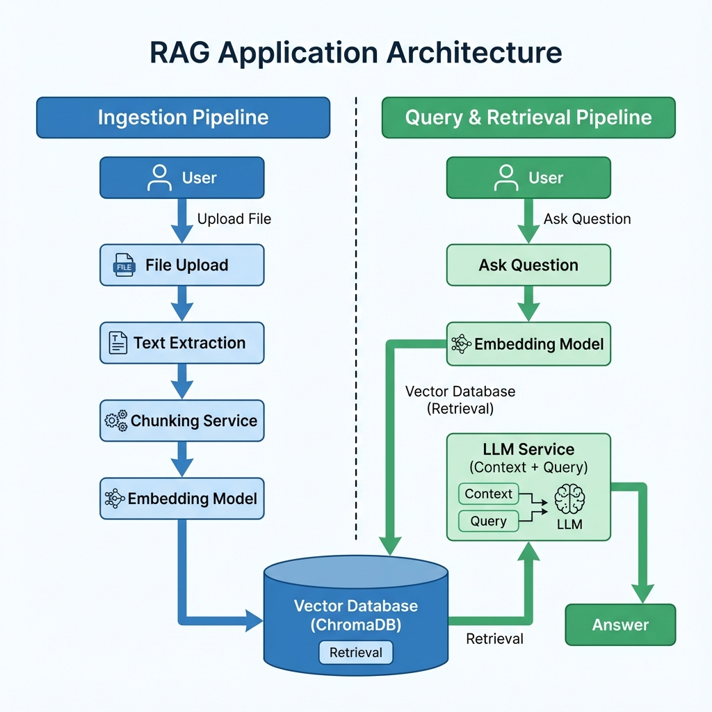

# Local RAG Studio

A powerful, local-first Retrieval-Augmented Generation (RAG) system designed for flexibility and privacy. This application allows you to ingest documents, chunk them using various strategies, generate embeddings, and query your knowledge base using state-of-the-art LLMs.

## Features

-   **Advanced Chunking**: Support for multiple strategies including Character, Recursive, Semantic, Hierarchical (Markdown), Paragraph, and Sentence chunking.
-   **Flexible Embeddings**: Integrate with Google Vertex AI, OpenAI, Azure OpenAI, AWS Bedrock, or run local models (SentenceTransformers).
-   **Vector Storage**: Built-in ChromaDB integration for efficient vector storage and retrieval.
-   **Interactive Chat**: Chat with your documents using a context-aware interface with history support.
-   **File Management**: Upload, manage, and visualize your document chunks.
-   **Visualization**: 2D/3D visualization of your embedding space.
-   **Privacy Focused**: Local SQLite database for settings and file metadata; local vector store.

## Project Structure

```
rag-app/
├── backend/                # FastAPI Backend
│   ├── core/               # Core logic (providers, config)
│   ├── services/           # Business logic (chunking, storage, files)
│   ├── database.py         # SQLite database connection
│   └── main.py             # API Entry point
├── frontend/               # React Frontend (Vite)
│   ├── src/
│   │   ├── api/            # API clients
│   │   ├── components/     # Reusable UI components
│   │   ├── pages/          # Application pages
│   │   └── store/          # State management (Zustand)
├── data/                   # Local data storage (uploads, database)
└── start_app.ps1           # Windows startup script
```

## Architecture



## Prerequisites

-   **Python 3.8+**
-   **Node.js 16+**
-   **Git**

## Installation

1.  **Clone the repository:**
    ```bash
    git clone <repository-url>
    cd rag-app
    ```

2.  **Backend Setup:**
    ```bash
    # Create virtual environment
    python -m venv .venv

    # Activate virtual environment (Windows)
    .\.venv\Scripts\Activate

    # Install dependencies
    pip install -r requirements.txt
    ```

3.  **Frontend Setup:**
    ```bash
    cd frontend
    npm install
    ```

## Running the Application

### Easy Start (Windows)

Simply run the provided PowerShell script from the root directory:

```powershell
./start_app.ps1
```

This will launch both the backend (port 8000) and frontend (port 5173) in separate windows.

### Manual Start

**Backend:**
From the root directory:
```bash
# Activate venv first
.\.venv\Scripts\Activate
python -m backend.main
```

**Frontend:**
From the `frontend` directory:
```bash
npm run dev
```

## Configuration

Once the app is running, navigate to the **Settings** page to configure your LLM and Embedding providers (e.g., API keys for OpenAI or Vertex AI). Settings are persisted locally.
